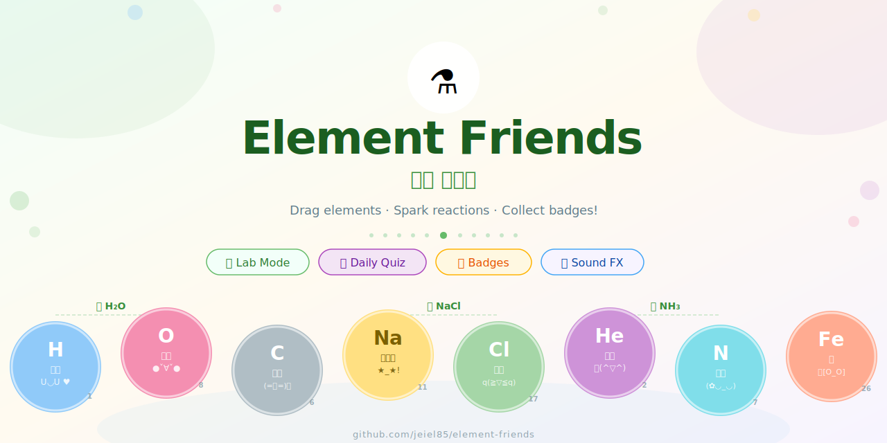

<div align="center" markdown="1">



# ⚗️ Element Friends · 원소 친구들

[](https://kotlinlang.org)
[](https://developer.android.com/jetpack/compose)
[](https://developer.android.com/about/versions/nougat)
[](LICENSE)

**귀여운 원소 친구들과 함께 배우는 어린이 화학 앱**

*Combine elements · Discover compounds · Learn chemistry!*

[🌐 Landing Page](https://jeiel85.github.io/element-friends) · [🐛 Report Bug](https://github.com/jeiel85/element-friends/issues)

</div>

---

## 📖 소개

**Element Friends**는 어린이들이 화학 원소와 화합물을 재미있게 배울 수 있는 Android 교육 앱입니다.

8가지 기본 원소(H, O, C, Na, Cl, He, N, Fe)를 귀여운 파스텔 캐릭터로 표현하고, 원소를 드래그해 합성하면 실제 화학 반응처럼 화합물이 만들어집니다. 매일 퀴즈와 배지 시스템으로 꾸준한 학습을 장려합니다.

> An Android educational app where children learn chemistry by combining adorable pastel element characters to discover real compounds like H₂O, CO₂, and NaCl.

---

## ✨ 주요 기능

| 기능 | 설명 |
|------|------|
| 🧪 **실험실 (Lab)** | 원소를 드래그해 합성 — H + O = 💧물, Na + Cl = 🧂소금 |
| 📅 **일일 퀴즈** | 날짜 기반 퀴즈로 매일 새로운 화학 문제 풀기 |
| 🏆 **배지 시스템** | 8가지 성취 배지 (아기 연금술사 → 웅장한 원소 박사) |
| 🔊 **사운드 이펙트** | 합성 성공 시 AudioTrack 기반 효과음 |
| 📚 **도감** | 발견한 화합물 목록이 Room DB에 자동 기록 |
| 🌈 **파스텔 테마** | 어린이 친화적 Material 3 파스텔 디자인 |
| 🗂️ **카테고리 필터** | 금속 / 기체 / 비금속·액체로 분류 |

---

## 🧬 원소 캐릭터

| 원소 | 기호 | 한국명 | 원자번호 | 표정 |
|:----:|:----:|--------|:-------:|------|
| 🔵 | **H** | 수소 | 1 | `U◡U ♥` |
| 🩷 | **O** | 산소 | 8 | `●ˇ∀ˇ●` |
| 🩶 | **C** | 탄소 | 6 | `(=ㅅ=)💤` |
| 💛 | **Na** | 나트륨 | 11 | `★_★!` |
| 💚 | **Cl** | 염소 | 17 | `q(≧▽≦q)` |
| 💜 | **He** | 헬륨 | 2 | `🎈(^▽^)` |
| 🩵 | **N** | 질소 | 7 | `(✿◡_◡)` |
| 🧡 | **Fe** | 철 | 26 | `🤖[O_O]` |

---

## 🧪 화합물 레시피

| 화합물 | 레시피 | 한국명 |
|:------:|:------:|--------|
| 💧 **H₂O** | H + O | 물 (Water) |
| 🫧 **CO₂** | C + O | 이산화탄소 |
| 🧂 **NaCl** | Na + Cl | 소금 |
| 🧪 **HCl** | H + Cl | 염산 |
| 💨 **NH₃** | H + N | 암모니아 |
| 🧱 **Fe₂O₃** | Fe + O | 녹 (Rust) |
| 🐮 **CH₄** | C + H | 메탄가스 |

---

## 🏆 배지 시스템

```
💧 아기 연금술사    첫 번째 화합물 합성
🎓 꼬마 학자        튜토리얼 완료
🌱 콤보 꿈나무      3콤보 연속 성공
⚡ 콤보 마스터      5콤보 연속 성공
🐨 실험실 대탐험가  화합물 3종 발견
🏆 웅장한 원소 박사 화합물 7종 ALL 발견
🎯 퀴즈 도전자      일일 퀴즈 첫 정답
📅 꾸준한 과학자    퀴즈 3회 또는 스트릭 2회
```

---

## 🏗️ 기술 스택

```
Language        Kotlin 2.0
UI              Jetpack Compose + Material Design 3
Architecture    MVVM (ViewModel + StateFlow)
Database        Room (SQLite)
Sound           AudioTrack (procedural synthesis)
Build           Gradle KTS
Min SDK         24 (Android 7.0 Nougat)
Target SDK      35 (Android 15)
```

### 프로젝트 구조

```
app/src/main/java/com/elementfriends/
├── MainActivity.kt
├── data/
│   ├── database/       # Room DB (GameDatabase, entities)
│   ├── model/          # ElementModels, CompoundRecipe, DailyQuiz, ElementBadge
│   └── repository/     # GameRepository
└── ui/
    ├── audio/          # SoundSynth (procedural audio)
    ├── screens/        # LabScreen (main game UI)
    ├── theme/          # Color, Type, Theme
    └── viewmodel/      # GameViewModel
```

---

## 🚀 시작하기

### 요구사항

- Android Studio Hedgehog (2023.1.1) 이상
- JDK 17+
- Android SDK 35

### 빌드

```bash
git clone https://github.com/jeiel85/element-friends.git
cd element-friends

# Debug APK 빌드
./gradlew assembleDebug

# 테스트 실행
./gradlew test

# 연결된 기기에 설치
./gradlew installDebug
```

---

## 🤝 기여하기

1. Fork the repository
2. Create your feature branch: `git checkout -b feature/amazing-element`
3. Commit your changes: `git commit -m 'feat: add amazing element'`
4. Push to the branch: `git push origin feature/amazing-element`
5. Open a Pull Request

---

## 📄 라이선스

MIT License — Copyright (c) 2025 jeiel85

---

<div align="center">

Made with 💚 and a lot of ⚗️

**원소 친구들과 함께 화학을 배워보세요!**

</div>